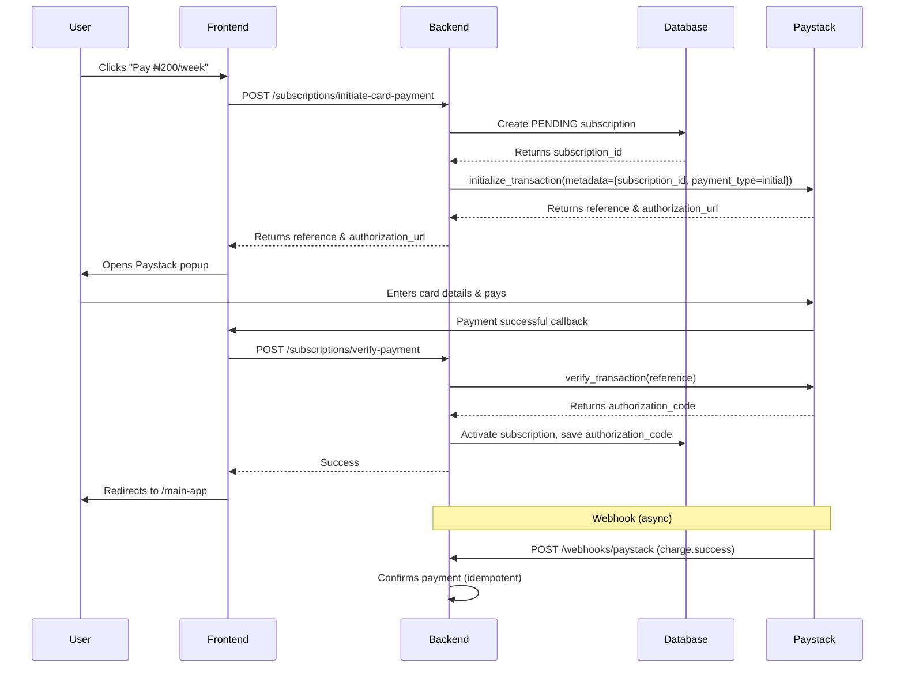
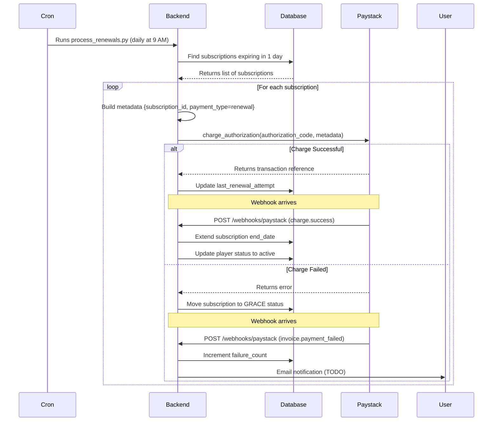

# Paystack Subscription Flow - Complete Guide

## Overview

We manage subscriptions in our backend, NOT using Paystack subscription plans. Paystack is only used for:
1. Initial card payment processing
2. Saving authorization codes
3. Charging saved cards for renewals (triggered by us)

## The Complete Flow

### 1. Initial Payment Flow



### 2. Recurring Charge Flow



## Key Implementation Details

### 1. Subscription Creation (initiate_card_payment)

**Before (Wrong):**
```python
# Created subscription AFTER Paystack call
response = await provider.initialize_transaction(...)
if response.success:
    subscription = Subscription(...)  # No ID yet!
    db.add(subscription)
    await db.commit()
```

**After (Correct):**
```python
# Create subscription FIRST to get ID
subscription = Subscription(payment_reference="")
db.add(subscription)
await db.flush()  # Get ID without committing

# Include subscription_id in metadata
metadata = {
    "subscription_id": subscription.id,  # Now we have ID!
    "payment_type": "initial"
}

response = await provider.initialize_transaction(..., metadata=metadata)
subscription.payment_reference = response.reference
await db.commit()
```

### 2. Webhook Handler Logic

```python
# In handle_charge_success()
metadata = payload.data.metadata
subscription_id = metadata.get("subscription_id")
payment_type = metadata.get("payment_type", "initial")

if payment_type == "initial":
    # Initial payment - usually already processed by verify_payment
    # Just confirm it's active
    pass

elif payment_type == "renewal":
    # Recurring charge - extend subscription period
    base_date = max(subscription.ends_at, now)
    new_end_date = base_date + timedelta(weeks=1)
    subscription.ends_at = new_end_date
```

### 3. Cron Job (process_renewals.py)

```python
# Find subscriptions expiring soon
subscriptions = db.query(Subscription).filter(
    Subscription.provider == PaymentProvider.PAYSTACK,
    Subscription.status == SubscriptionStatus.ACTIVE,
    Subscription.auto_renew == True,
    Subscription.authorization_code.isnot(None),
    Subscription.ends_at <= now + timedelta(days=1)
)

# Charge each subscription
for subscription in subscriptions:
    metadata = {
        "subscription_id": subscription.id,
        "payment_type": "renewal",  # Important!
        "plan_id": subscription.plan_id
    }
    
    transaction = await provider.charge_authorization(
        authorization_code=subscription.authorization_code,
        email=subscription.email,
        amount=plan.price,
        metadata=metadata  # subscription_id included here
    )
```

## Why This Approach?

### ✅ Benefits

1. **Full Control:** We control when and how to charge users
2. **Flexible Logic:** Can implement grace periods, retry logic, custom billing
3. **Better Tracking:** subscription_id in every transaction
4. **No Paystack Plans:** Don't need to sync plans with Paystack
5. **Easier Testing:** Can manually trigger renewals

### ❌ Previous Issues (Fixed)

1. ~~No subscription_id in initial payment metadata~~ ✅ Fixed by creating subscription first
2. ~~Webhook couldn't differentiate initial vs renewal~~ ✅ Fixed with payment_type field
3. ~~No way to trigger recurring charges~~ ✅ Fixed with RecurringChargeService
4. ~~Expired subscriptions extended from old date~~ ✅ Fixed with `max(ends_at, now)`

## Testing the Flow

### Test Initial Payment

```bash
# 1. Start backend
make dev

# 2. Go to /subscribe page
# 3. Select weekly plan
# 4. Enter details and pay (test card: 4084084084084081)
# 5. Check logs for:
#    - "Created pending subscription X"
#    - "Subscription X activated"
#    - Webhook: "Initial payment webhook for subscription X"

# 6. Verify in database
make db-shell
SELECT id, status, payment_reference, authorization_code FROM subscriptions WHERE id = X;
```

### Test Recurring Charge

```bash
# 1. Update subscription to expire soon
UPDATE subscriptions SET ends_at = NOW() + INTERVAL '6 hours' WHERE id = X;

# 2. Run cron script
python -m apps.api.scripts.process_renewals

# 3. Check logs for:
#    - "Found 1 subscriptions due for renewal"
#    - "Successfully charged subscription X"
#    - Webhook: "Processing renewal charge for subscription X"
#    - "Renewed subscription X until 2026-04-15"

# 4. Verify end date extended
SELECT id, ends_at, metadata FROM subscriptions WHERE id = X;
```

### Test Failed Renewal

```bash
# 1. Use a test card that will decline
# 2. Run renewal script
# 3. Check logs for:
#    - "Failed to charge subscription X"
#    - Webhook: "Invoice payment failed for subscription X"
#    - "Moved subscription X to grace period"

# 4. Verify grace status
SELECT id, status, metadata->'failure_count' FROM subscriptions WHERE id = X;
```

## Production Setup

### 1. Configure Cron Job

```bash
# Add to crontab
crontab -e

# Run daily at 9 AM
0 9 * * * cd /path/to/recalio && /path/to/python -m apps.api.scripts.process_renewals >> /var/log/renewals.log 2>&1
```

### 2. Configure Webhooks

**Paystack Dashboard:**
- URL: `https://your-domain.com/api/v1/webhooks/paystack`
- Events: `charge.success`, `invoice.update`, `invoice.payment_failed`

**IntelliHQ Dashboard:**
- URL: `https://your-domain.com/api/v1/webhooks/intellihq`

### 3. Monitor

Set up alerts for:
- Failed renewal charges (failure_count > 3)
- Webhook signature failures
- Cron job failures
- Subscriptions in grace period > 3 days

## Summary

**Key Points:**
- ✅ We manage subscriptions, not Paystack
- ✅ subscription_id included in ALL Paystack transactions
- ✅ payment_type field differentiates initial vs renewal
- ✅ Cron job triggers recurring charges daily
- ✅ Webhooks confirm charges and update database
- ✅ Idempotency prevents duplicate processing
- ✅ Grace period for failed payments

**Files Modified:**
- `apps/api/app/services/subscription_service.py` - Now creates subscription before Paystack call
- `apps/api/app/services/paystack_webhook_service.py` - Handles payment_type field
- `apps/api/app/services/recurring_charge_service.py` - New service for renewals
- `apps/api/scripts/process_renewals.py` - New cron job script
